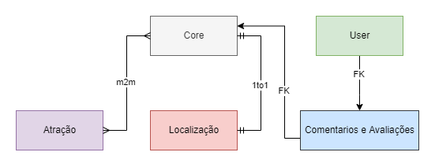

# API de pontos Turisticos

## Django Rest Framework

# TODO - API

- [X] Criação do ambiente virual
- [X] Instalação dos pacotes do django e djangorestframework
- [X] Configuração do vscode
- [X] Criação do repositório no github
- [X] Push da base da aplicação para o repositório github
- [X] Implementação da Base da aplicação usando django
- [X] Implementação do endpoint para Pontos Turisticos ( Core ) Viewsets e Serializers
- [X] Implementação do endpoint para Pontos Atrações ( Core ) Viewsets e Serializers
- [ ] Implementação do endpoint para Pontos Endereços ( Core ) Viewsets e Serializers
- [ ] Implementação do endpoint para Pontos Comentários ( Core ) Viewsets e Serializers
- [ ] Implementação do endpoint para Pontos Avaliações ( Core ) Viewsets e Serializers
- [ ] ...
- [ ] ...
- [ ] ...
- [ ] ...
- [ ] ...
- [ ] ...
- [ ] ...
- [ ] Revisão
- [ ] Publicação da API na web